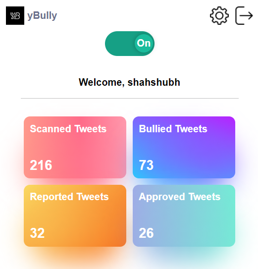
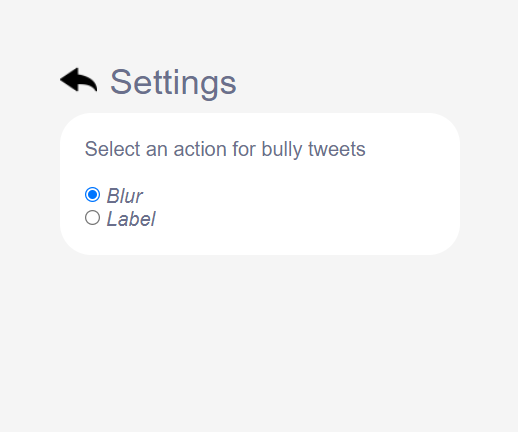
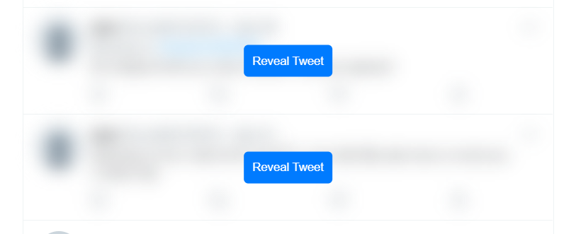
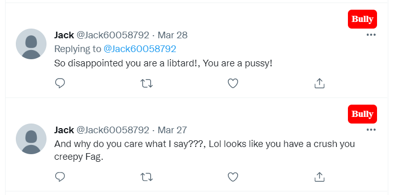
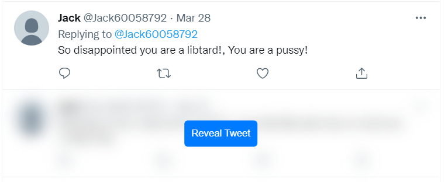
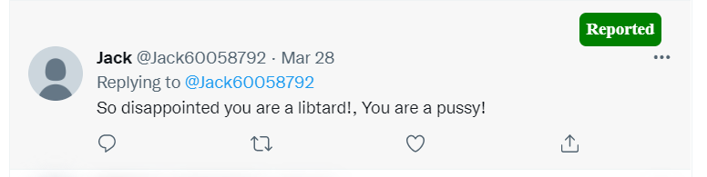

 <div align="center">


yBully
==========

[](https://reactjs.org/docs/getting-started.html)
[](https://firebase.google.com/docs)
[](https://code.visualstudio.com/ "Visual Studio Code")


</div>

Table of contents
-----------------

* [Introduction](#introduction)
* [Features](#features)
* [Demo](#demo)
* [Installation](#installation)
* [Contributing](#contributing)
* [License](#license)


Introduction
-------------

yBully is a chrome extension for detecting cyberbullying tweets on twitter along with restricting users from posting any bully tweet and more...


Features
---------

* Detect cyberbullying tweets on twitter across all pages.
* Blur / Label tweets that are bully.
* Restrict users from posting any bully tweet.
* Report incorrectly predicted tweets.
* Increase your trust score by getting your reported tweets approved.
* Trusted users can directly contribute to the data being sent to model during retraining.
* View your statistics.


Demo
-----

<div align="center">
    <h4 align="center">Home Page &nbsp&nbsp&nbsp&nbsp | &nbsp&nbsp&nbsp&nbsp Settings Page</h4>
    
    
    <h4 align="center">Blurred bully tweets</h4>
    
    <h4 align="center">Labelled bully tweets</h4>
    
    <h4 align="center">Revealed tweet</h4>
    
    <h4 align="center">Reported bully tweet</h4>
    
    
</div>

<br />


Installation
-------------

Before starting with installation you would require to setup a [firebase project](https://firebase.google.com/).

Also you need yBully's websocket running. For this clone this [project](https://github.com/yBullyy/yBully-websocket.git) and run it.

Once above thing are done, follow below steps.

1. Clone this repository `git clone https://github.com/yBullyy/yBully.git`.
2. Create env.js file inside `ybully/src/` directory.
3. Add the following lines to `env.js` file.

```js
export const FIREBASE_API_KEY = '<your-firebase-api-key>';
export const FIREBASE_AUTH_DOMAIN = '<your-firebase-auth-domain>';
export const FIREBASE_DATABASE_URL = '<your-firebase-database-url>';
export const FIREBASE_PROJECT_ID = '<your-firebase-project-id>';
export const FIREBASE_STORAGE_BUCKET = '<your-firebase-storage-bucket>';
export const FIREBASE_MESSAGING_SENDER_ID = '<your-firebase-messaging-sender-id>';
export const FIREBASE_APP_ID = '<your-firebase-app-id>';
export const API_URL = '<your-websocket-url-after-running-ybully-websocket-project>'; // for eg: "ws://localhost:8000"

```

4. Go to root directory by running `cd ybully`.
5. Run `npm install` to install all the required dependencies.
6. Run `npm run dev` to run the chrome extension in developer mode.
7. Open the browser and go to `chrome://extensions/` url.
8. Turn on developer mode from top right if its not on.
9. Now, from top left click load unpacked button and then navigate to your project folder in the popup and select dist/ folder.
10. Now the chrome extension has been installed you can start using it after signing up by clicking on the extension's icon in the browser.


License
--------

[](https://github.com/yBullyy/yBully/blob/main/LICENSE)


Stargazers
-----------
[](https://github.com/yBullyy/yBully/stargazers)


<br/>
<p align="center"><a href="https://github.com/yBullyy/yBully#"></a></p>